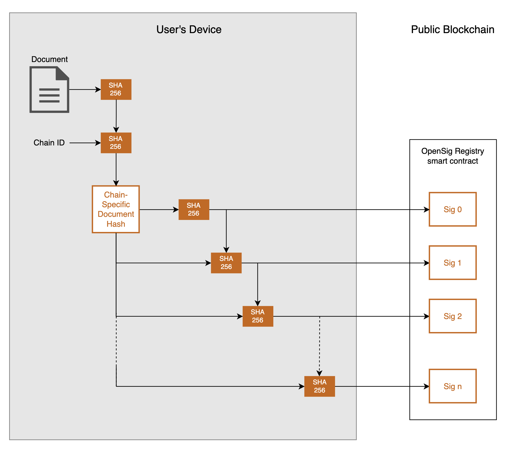

# OpenSig Standard v0.1

## Version History

| Version | Purpose                | Link          |
|:-------:|------------------------|---------------|
| 0.1     | Initial public version | This document |

---

## Overview

The OpenSig standard defines a deterministic, privacy-preserving mechanism for signing documents and verifying their existence and authenticity on supported blockchains. Documents are **never uploaded**; instead, OpenSig signs a hash derived from the document, ensuring **zero-knowledge proofs** of possession.

## Design Goals

- 🔐 **Privacy-first**: Only derived hashes and optional annotations are published on-chain.
- 🧾 **Deterministic**: Signature chains are predictable with the original document.
- 🔁 **Multi-chain**: Supports distinct signature chains per blockchain.
- ✍️ **Non-repudiation**: All signatures are published immutably to smart contract registries.
- 🔍 **Verifiable**: Anyone with the document can independently verify signatures.

---

## Signature Generation

Each signature is a SHA-256 hash derived from the document, chain id and the previous signature, forming a deterministic chain. The algorithm ensures signatures are different across blockchains and cannot be linked together without the original document.

The document, it's hash and the chain-specific hash remain secure on the user's device. Only the derived signature hashes are published, preventing signatures from being linked to the document or each other.

### Definitions

Let:

- `H()` = SHA-256
- `document` = the full file content
- `chainId` = the numeric ID of the blockchain
- `H_d` = `H(document)` = Document hash
- `H_c` = `H(chainId || H_d)` = Chain-specific hash

### Signature Sequence

- `Sig_0 = H(H_c)`
- `Sig_n = H(H_c || Sig_{n-1})` for n > 0

This chain ensures:
- A new signature depends on the previous.
- A chain cannot be reconstructed or linked without `H_d`.

---

## Data Encoding

Each signature can include an optional **data packet**, used for annotations.

### Header

Each data packet starts with a 2-byte header:
- **Byte 0**: Data version (currently `0x00`)
- **Byte 1**: Bitfield:
  - Bit 7: Encryption flag (1 = encrypted)
  - Bits 0–6: Data type

### Data Types

| Type | Value | Description        |
|------|-------|--------------------|
| 0    | `0x00`| Plain text (Unicode) |
| 1    | `0x01`| Binary data (hex)  |

### Encrypted Format

When encrypted (AES-GCM):
- Uses `H_d` as the key
- Adds a 12-byte IV prefix

| Segment       | Description         |
|---------------|---------------------|
| Header        | 2 bytes             |
| IV            | 12 bytes (AES-GCM)  |
| Ciphertext    | Variable length     |

---

## Signature Publication

Signatures are published to a **Registry Smart Contract** on the target blockchain. Signatures are not recorded on-chain, rather each publication logs an event with:

- Block timestamp
- Signatory address
- Signature hash (`Sig_n`)
- Data packet (if any)

Contracts prevent duplicate signatures and the emitted signature events are used for document verification.

---

## Verification Process

To verify a document:

1. Compute `H_d = H(document)`
2. Compute `H_c = H(chainId || H_d)`
3. Reconstruct `Sig_n` hashes
4. Query the blockchain registry for event matches
5. For each match:
   - Validate signer
   - Decrypt/interpret data packet (if applicable)

For additional security, verify against the blockchain transaction identified by the transaction hash in the event.

---

## Chain-Specific Signature Isolation

To prevent replay attacks across chains:
- Signature chains include the `chainId` in `H_c`
- This ensures identical documents produce unrelated signatures on different blockchains

---

## Security Considerations

- Only document holders can generate or discover signatures for that document. 
- It is impossible for someone to sign a document that is not in their possession unless either the document hash or chain-specific document hash is exposed.
- impossible to link
- Signatures are unforgeable without the private key and document.
- Annotations remain private unless explicitly published in an unencrypted format.
- While the list of signatures created by a user is publicly accessible, the user's identity remains anonymous unless they choose to associate their identity with their address (e.g. by connecting with a contact). Additionally, the signed documents cannot be identified without access to the original documents.

---

## License

This specification is licensed under the [Creative Commons Attribution 4.0 International License (CC BY 4.0)](https://creativecommons.org/licenses/by/4.0/).

© 2025 OpenSig
